# 报告
   

## 1、问题和背景

见 [需求分析文档](https://github.com/2018YX-game/repo/blob/master/doc/%E9%9C%80%E6%B1%82%E5%88%86%E6%9E%90/%E9%9C%80%E6%B1%82%E5%88%86%E6%9E%90.md)  

## 2、开发环境及工具

本项目基于`QT5.9`以及加入了`c++17 any类`来实现。  
整体架构基于`MVVM`(`Model-View-ViewModel`)实现。  
在开发过程中，使用了`AppVeyor`工具实现了持续交互。  

## 3、开发计划和分工

第一轮迭代由张思淡负责View和Window层，吕慕凡负责Model和ViewModel层，王航宇负责APP层。  
第二轮迭代由吕慕凡负责View和Window层，王航宇负责Model和ViewModel层，张思淡负责APP层。  
第三轮迭代由王航宇负责View和Window层，张思淡负责Model和ViewModel层，吕慕凡负责APP层。  
三轮迭代完成，每个人都把MVVM框架的各个分工都做了一遍。  

## 4、每轮迭代效果说明

### 第一轮迭代
第一轮迭代包括0.0版,0.1版,0.2版和0.3版。  
第一轮迭代中Window层有2个页面，一个开始游戏页面，一个游戏界面。  
Model和ViewModel层实现了更新矩阵和游戏逻辑判断功能。  
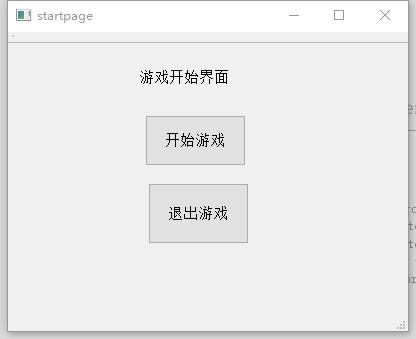  
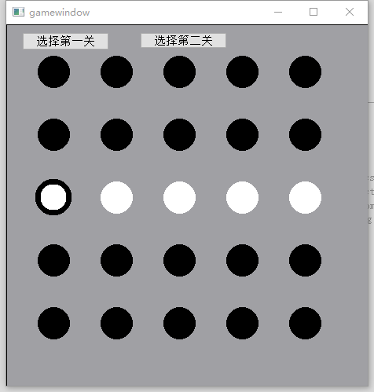  

### 第二轮迭代

第二轮迭代包括0.4版。  
第二轮迭代中Window层增加了2个页面，一个选关卡界面，一个游戏成功或失败的通知界面。  
Model和ViewModel层增加关卡数到10关，并且实现显示的图案的形状不仅仅是长方形的。       
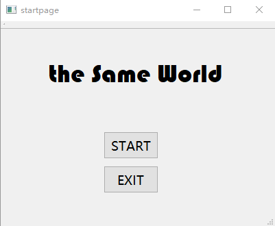    
    
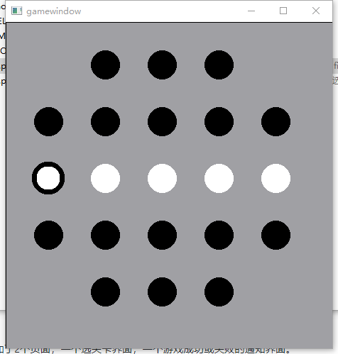   
   
 
### 第三轮迭代和最终运行效果图

第三轮迭代包括0.5版。  
第二轮迭代中Window层主要美化了界面，增加了关于我们的界面，并更改了翻转的效果。  
Model和ViewModel层修改了游戏的逻辑判断。  
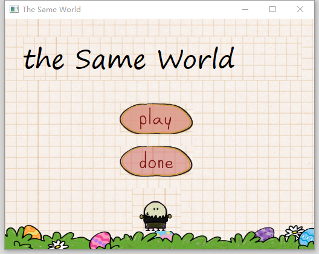    
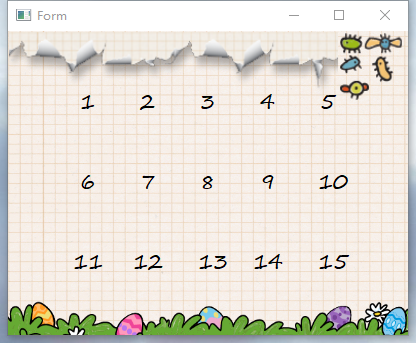    
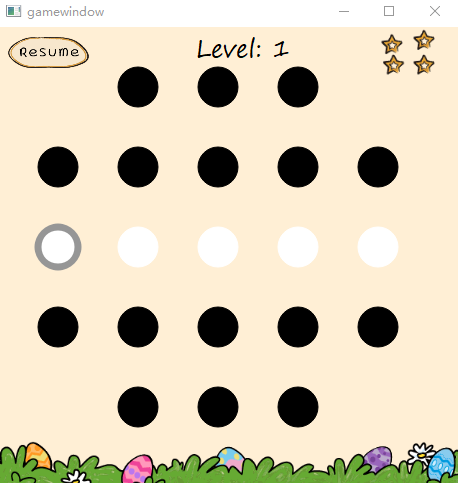   
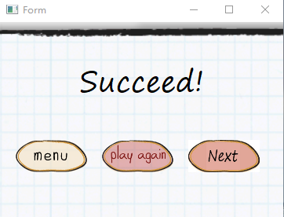   
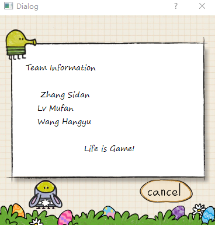   
### 项目目录树
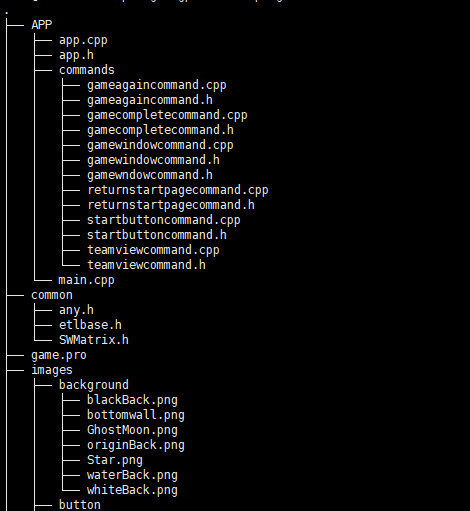   
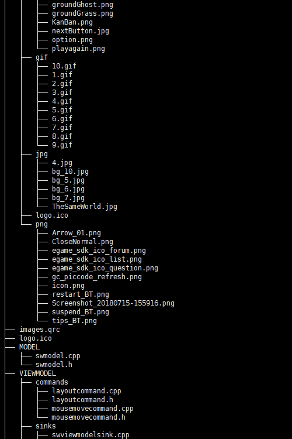   
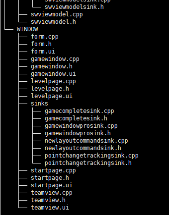   

## 5、小组成员
- 组长： 
  - 张思淡 ： 进行分工协调，在第一轮迭代中负责实现View和Window层

- 组员：
  - 吕慕凡： 第一轮迭代中负责实现Model和ViewModel层各项基本功能
  - 王航宇： 第一轮迭代中负责APP层的组装

## 6、二次开发

每实现一个新功能需要增加一个对应的`command`类，command本身存在于ViewModel中，并提供get方法给View层进行set方法实现绑定，从而事先View->ViewModel的通信。

ViewModel执行Command的过程是调用Model中对应方法进行数据操作的过程。

在Model层完成数据操作之后，通过一个通知（绑定方式类似于command）来实现model与ViewModel的通信。

在此之后，ViewModel通过通知告诉View更新显示窗口。

二次开发只需增加相应的Command类并在model中实现功能，并讲command和notification绑定好即可。

## 7. 版权声明

特此感谢热因子游戏工作室的资源提供，本作品系二次开发，并无任何版权问题

