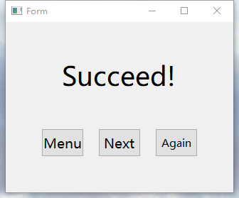

## 吕慕凡个人报告

---
Author： 吕慕凡
DATE： 2018-7-21
---

### 分工任务及解决方案
我们的项目中包含了3次迭代，每轮迭代中，我分别负责 `Model层 和 Viewmodel层以及头文件SWMatrix.h`,`Window层`,`App层` 模块的组织和实现。

### 设计思路
####SWMatrix.h
在我们的构想中，使用矩阵的结构来表示游戏界面中的点阵。我们需要了解点的一系列属性,包括点的颜色，是否是起点，是否鼠标已经经过该点。为此，我们建立了一个`SWPoint` class，用来描述点的属性。然后在`SWMatrix` class中，我们创建一个SWPoint类型的`vector`动态数组成员，用于记录点的排列及其属性特征。

为了响应鼠标移动事件，根据鼠标移动的轨迹对点的颜色做翻转，并且，对于从一个起点出发的一条路径上的点都只能翻转一次。我们需要记录这一特征。起初，在第一轮迭代中，我们采用的是用点的`isMoveOn属性`来描述该点是否已经被经过。后来，在第二轮迭代中，为了能够实现逐步撤销走过的路径的功能，我们取消了`isMoveOn属性`，转而使用一个动态数组来记录经过路径上的点的坐标。

####SWModel和ViewModel
我在第一轮迭代中，初步实现了`SWModel`生成点阵数据，发出`matrix`属性改变通知，并由挂在`SWViewModel`上的消息接受器接受属性变化的功能。以及执行model生成点阵数据的`layoutcommand`命令。

####Window
在第二轮迭代中，初步完成设计了选关卡界面和游戏成功或失败后的弹窗界面，及其相关的command命令，和第二轮中增加的鼠标拖动翻转轨迹上的点对应的gameWindow的命令接收器。
效果图如下：

####APP
第三轮中，我们增加了一个团队信息介绍的界面，我负责在APP层实现该界面的组织。为此增加了相关的两条command命令，即`teamViewCommand`和`returnStartPageCommand`。

### 心得体会
这是我首次经历团队多人协作开发软件的过程，受益匪浅。和我们以前的“线上”（通过聊天工具的交流和文件传输）团队合作不同，这次我们的团队协作都是在线下进行面对面的交流和讨论，能及时地交换意见，一起探讨交流、查漏补缺。在采用的工具方面，Github代码托管方便了我们进行代码的版本控制。此外，通过搭建`MVVM架构`，可以提升我们团队协作开发的效率，支持多人同时进行不同模块代码的编写，并且在编写代码时不需要了解对方模块的具体实现方法，只需利用智能指针调用接口函数，发送或接受通知，就可以实现模块之间的沟通。

### 对课程的改进意见
建议老师在讲解MVVM框架的时候，可以结合实例来讲解，帮助学生更好地理解其内容。