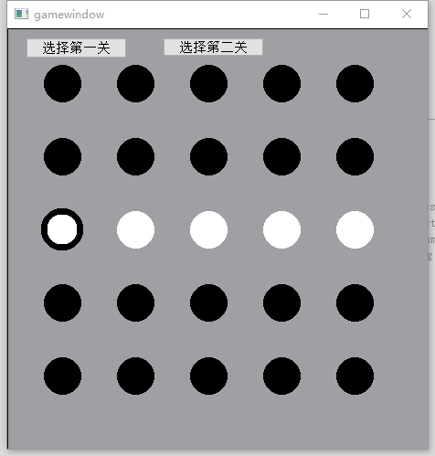

# 张思淡的个人报告
我作为本次项目的组长，统筹了组员的工作。    

# 分工任务
在项目最初的时候，我们小组先确定下来用Qt做一个小游戏。    
然后我为了使Qt的项目能在appveyor上自动进行编译，然后推送到GitHub上，修改了环境配置和编译命令很多遍。  
第一轮迭代我负责View和Window层   
第二轮迭代我负责负责APP层   
第三轮迭代我负责负责Model和ViewModel层   

## 设计思路和运行效果图

第一轮迭代
我设计了window层的2个页面，并写了接收器，接受viewmodel层发来的刷新页面的通知，同时也写了一个命令指向model层。  
效果图如下：   
   
   

## 心得体会

这门课让我了解了MVVM框架的具体实现过程，之前我一直用的是MVC框架，没用过MVVM。
现在用了MVVM框架后，感觉协同开发变得更容易了。  
这次的游戏开发使用了GitHub+AppVeyor，从工具上就碾压了之前的开发工具。  
以后对于团队协作类开发会尽量把这次学到的用上。  

## 对课程的建议

