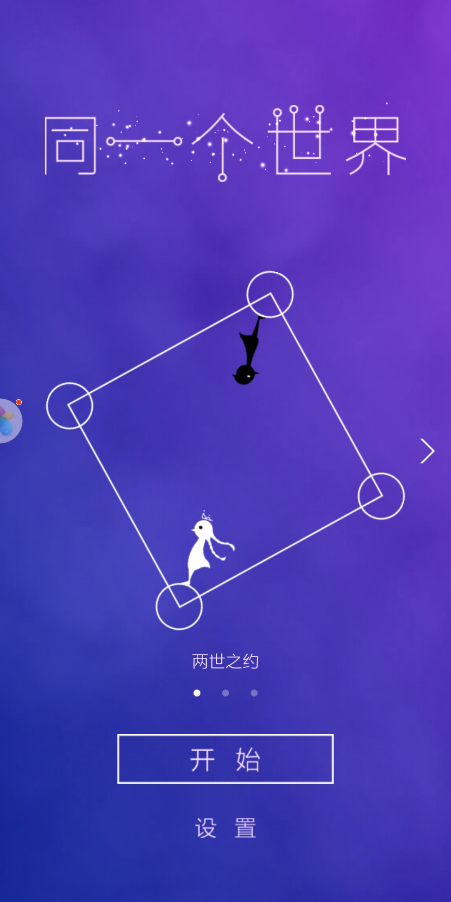
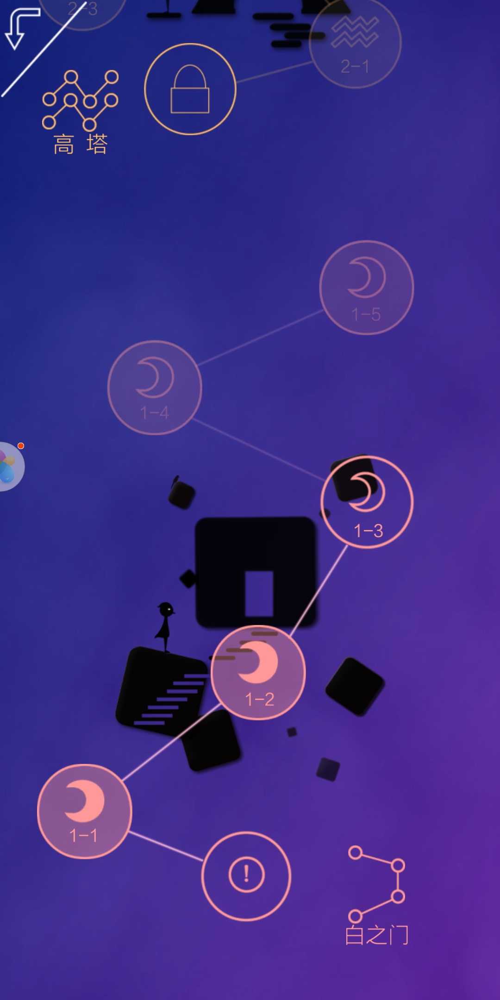
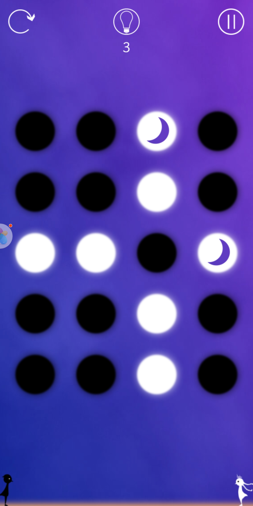

# 需求分析
我们打算做一个类似翻转棋的游戏，有以下界面和功能  

1.开始界面，可以进入和退出  
   
2.选关卡界面，可以选择不同难度的关卡。   
  
3.关卡界面  
  
游戏试玩：  
  
具体的游戏规则是从有月亮的圆圈开始，按直线或者折线连任意长度，结束后把线上的所以圆圈都转换颜色。  
游戏胜利的条件是所有圆点是同一种颜色。   

## 扩展功能（有时间增加） 
实现用户自定义关卡  

